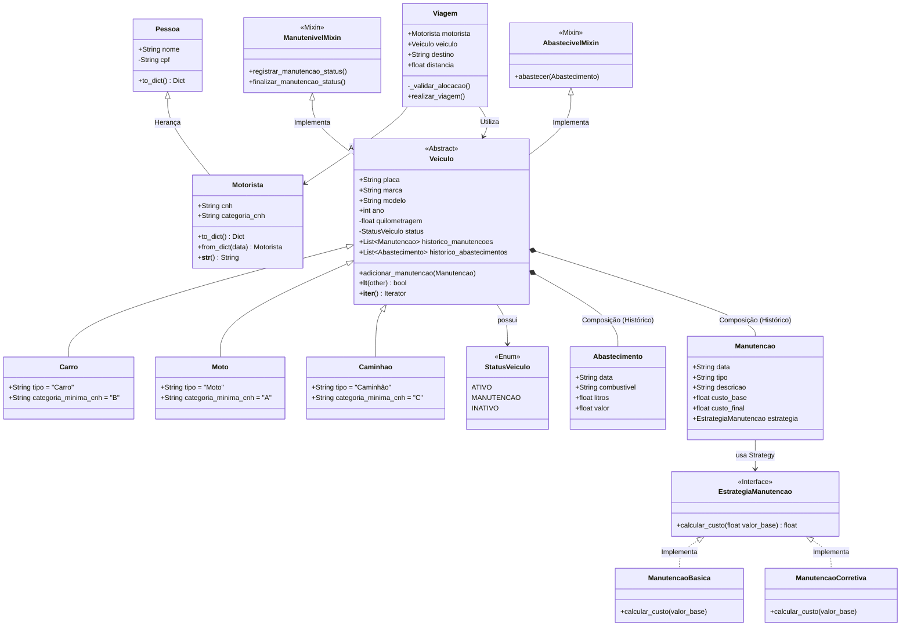

# Sistema de Gerenciamento de Frota de Veículos (v1.0)

Sistema para gerenciamento de frota (veículos, motoristas, manutenção, abastecimento) focado em aplicar conceitos avançados de POO (herança, encapsulamento) e arquitetura com padrão de Repositório.

## Descrição do Projeto

Este projeto consiste no desenvolvimento de um sistema de software para gerenciar a frota de veículos de uma transportadora. O sistema visa substituir controles manuais, permitindo o cadastro detalhado de veículos (carros, motos, caminhões) e motoristas, além de gerenciar as operações diárias da empresa.

As principais funcionalidades incluem o controle de alocação de veículos para viagens, registro de abastecimentos e manutenções, e validação de regras de segurança (como a compatibilidade entre a categoria da CNH do motorista e o tipo de veículo).

## Objetivo

O objetivo principal deste trabalho é aplicar, na prática, os conceitos fundamentais da disciplina de Programação Orientada a Objetos (POO) do curso de Engenharia de Software.

O projeto foca na demonstração de competências em:
- Abstração e Modelagem: Transformar requisitos do mundo real em classes de software.
- Herança e Polimorfismo: Reutilizar código através de hierarquias de classes.
- Encapsulamento: Proteger os dados internos das classes e garantir a integridade do sistema através de validações.
- Regras de Negócio: Implementar lógicas de validação.

## Como Executar

Pré-requisitos
- Python 3.8+ instalado.
- Biblioteca pytest (para rodar a suíte de testes).

Instalar Dependências (Opcional):
```
pip install -r requirements.txt
```

Executar o Sistema:
```
python main.py
```

Utilize o menu numérico para navegar entre as opções.

Executar Testes Automatizados
Para validar as regras de negócio (incluindo o Strategy e validações de CNH):
```
pytest -v
```

## Estrutura do Projeto
```
sistema-gestao-frota/
│
├── main.py           # Ponto de entrada (Interface CLI e Menus)
├── controller.py     # Lógica de aplicação, orquestração e acesso a dados
├── models.py         # Classes de domínio, Regras de Negócio e Padrões (Strategy)
├── views.py          # Camada de apresentação (Prints formatados)
├── test_models.py    # Testes unitários automatizados
├── README.md         # Documentação do projeto
└── data/             # (Gerado automaticamente) Armazena veiculos.json, etc.
```

## Estrutura de Classes (UML Textual)

Abaixo está a modelagem das entidades principais do domínio do sistema.

### Classe: Pessoa
**Atributos:**
- nome: str
- cpf: str
---
### Classe: Motorista
**Herda de: Pessoa**

**Atributos:**
- categoria_cnh: CategoriaCNH
- disponivel: bool
- historico_viagens: list[Viagem]

**Métodos:**
- adicionar_viagem(viagem)
- verificar_compatibilidade(veiculo)
- concluir_viagem(viagem)
- cancelar_viagem(viagem)

---

### Classe: Veiculo
**Atributos:**
- placa: str
- marca: str
- modelo: str
- tipo: str (carro, moto, caminhão)
- ano: int
- quilometragem: float
- status: StatusVeiculo (ativo, manutenção, inativo)
- historico_abastecimentos: list[Abastecimento]
- historico_manutencoes: list[Manutencao]

**Métodos:**
- abastecer(...)
- registrar_manutencao(...)
- liberar_manutencao()
- atualizar_quilometragem(distancia)

---
### Classe: Carro
**Herda de: Veiculo**
- (Herda todos os atributos e métodos de Veiculo)

---

### Classe: Moto

**Herda de: Veiculo**

- (Herda todos os atributos e métodos de Veiculo)

---

### Classe: Caminhao
**Herda de: Veiculo**
- (Herda todos os atributos e métodos de Veiculo)

---

### Classe: Viagem
**Atributos:**
- origem: str
- destino: str
- distancia_km: float
- status: StatusViagem
- motorista_alocado: Motorista (Referência)
- veiculo_usado: Veiculo (Referência)

---

## Diagrama de Classes

